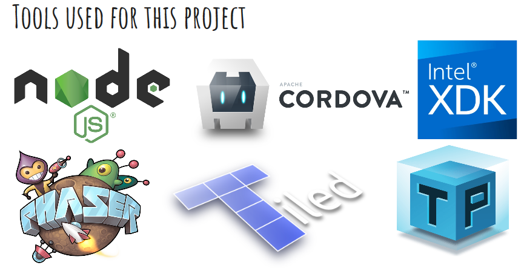

# SuperMeowPhaserFinal

Project purpose: COMP 422 Software Development for Mobile Devices 
Game type: 2d platformer game 
Team Number: Team C (super meow) 

Tools used for this project: 

This project is built for the purpose of mobile use, but you may try the game at the github pages link:
https://developerjw.github.io/SuperMeowPhaserFinal/www/

Game Levels: 
  1.Level 1: GrassLand 
  
   
  2.Level 2: DesertLand 
  
   
  3.Level 3: Ghost Town 
  

